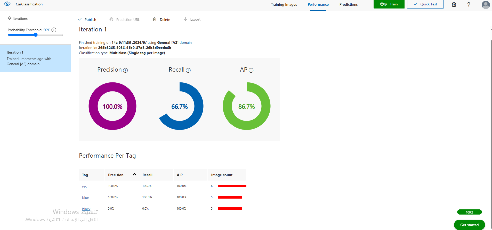
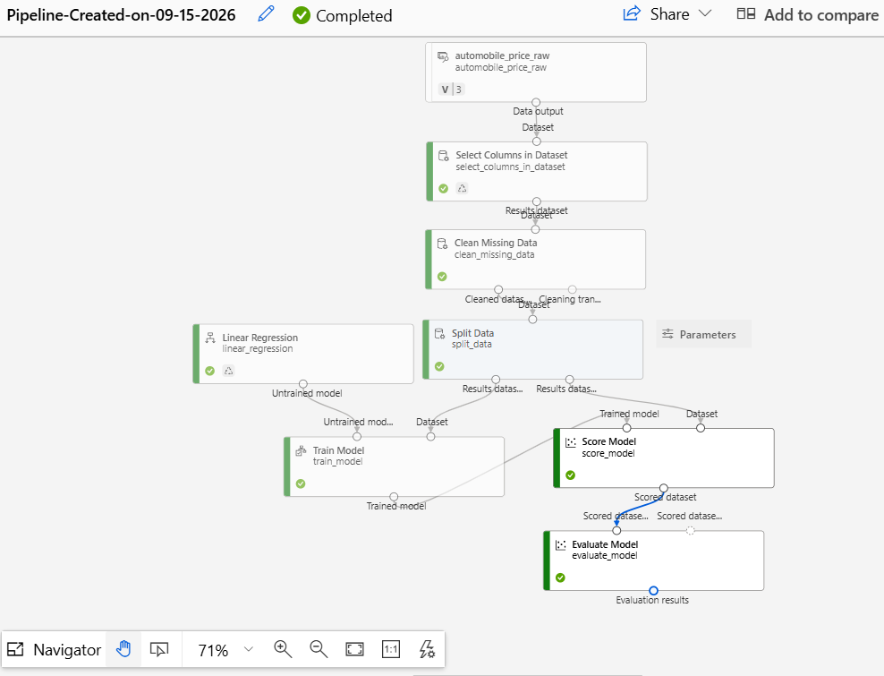
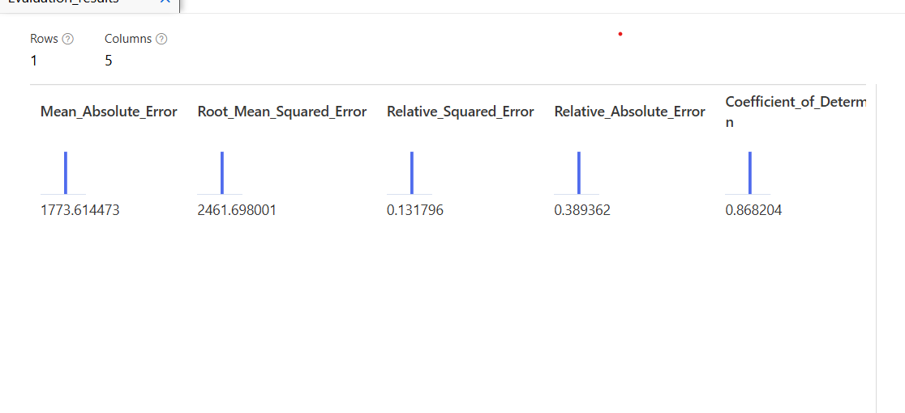

# Car Dealership Cloud Data Project 

This repository documents my progress in building a cloud data infrastructure for a car dealership using Microsoft Azure.

---

## Task 1: Environment Setup (Cloud Infrastructure)
In this initial task, I provisioned the foundational Azure resources required for the project. To comply with location policies, all resources were deployed in the **Italy North** region.

**Resources Created:**
* **Resource Group:** `CarDealership-RG` (Logical container for project resources).
* **Storage Account:** `cardealershipdata26` (Used for storing raw and processed data).
* **Azure Data Factory:** `CarDealershipADF26` (Used for data integration and automated pipelines).
* **Blob Container:** Created a container named `adftutorial` to hold the data files.

---

## Task 2: Data Ingestion (Azure Data Factory)
The goal of this task was to simulate ingesting raw car data into our cloud storage and moving it using an automated pipeline.

**Steps Completed:**
1. **Data Preparation:** Created a local dataset `data.txt` containing car models and prices.
2. **Manual Upload:** Uploaded the dataset into the `input` folder within the `adftutorial` container in Azure Blob Storage.
3. **Pipeline Automation:** 
   * Opened **Azure Data Factory Studio**.
   * Used the **Copy Data tool** (Built-in copy task) to create an automated pipeline (`ADFQuickStart`).
   * Configured the Source (`input` folder) and Destination (`output` folder).
4. **Execution:** Successfully ran the pipeline, which automatically created the `output` folder and copied `emp.txt` into it.

## Task 3: Custom Vision Model (AI)
In this task, I successfully built and trained an image classification model using **Azure Custom Vision** to categorize cars based on visual features (e.g., colors).

**Steps Completed:**
1. Provisioned a Custom Vision training resource in a policy-compliant region.
2. Created a new Multiclass Classification project.
3. Uploaded car images and categorized them using manual tags (`red`, `blue`, `black`).
4. Trained the AI model and evaluated its performance metrics (Precision and Recall).

*(Task 3 - Model Training Performance)*

### Task 4: Automobile Price Prediction (Machine Learning)

In this task, I successfully built and trained a regression model using **Azure Machine Learning Designer** to predict automobile prices based on their technical specifications and features.

**Steps Completed:**

1. Provisioned an Azure Machine Learning workspace and a compute cluster in a policy-compliant region.
2. Created a new Machine Learning pipeline using the visual drag-and-drop designer.
3. Imported the raw automobile dataset, excluded irrelevant columns, and cleaned missing data by removing incomplete rows.
4. Split the dataset (70/30) and trained a **Linear Regression** model targeting the `price` column.
5. Scored the test data and evaluated the model's performance metrics ($R^2$, MAE, and RMSE).

*(Task 4 - Pipeline Completion and Evaluation Metrics)*

<!-- أضف مسار صورك هنا بدلاً من الروابط المؤقتة -->

